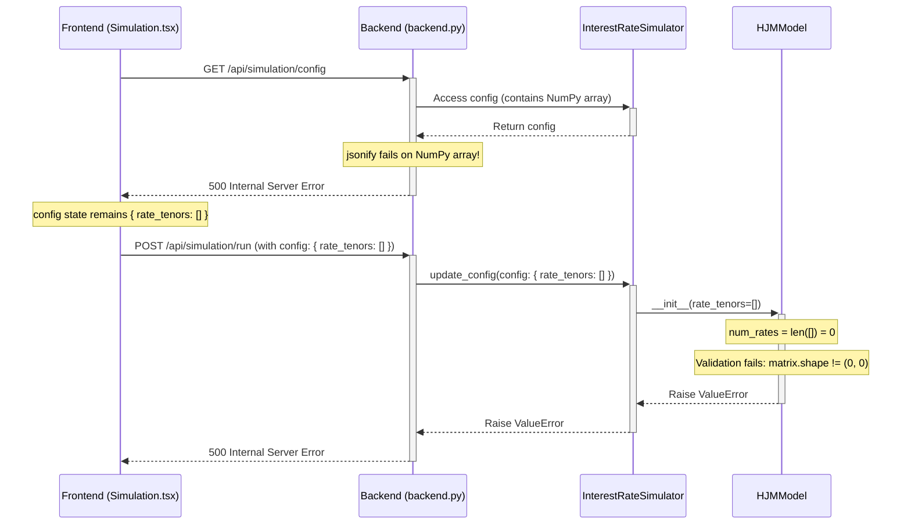

# Debugging Plan: Simulation Failure (ValueError: Correlation matrix must be 0x0)

## Diagnosis

1.  **Initialization Problem:** `InterestRateSimulator` is initialized with a default config containing a NumPy array for `correlation_matrix`.
2.  **API Failure (`/api/simulation/config`):** The `GET /api/simulation/config` endpoint fails because Flask's `jsonify` cannot serialize the NumPy array in the config, resulting in a 500 error.
3.  **Frontend State:** The frontend receives an error and keeps its initial state with `rate_tenors: []`.
4.  **Simulation Run Failure (`/api/simulation/run`):** The frontend sends the config with empty `rate_tenors` to the backend.
5.  **Backend Processing:** The backend tries to update the simulator config with the empty `rate_tenors`.
6.  **Model Initialization Error:** `HJMModel` is initialized with `num_rates = 0`.
7.  **ValueError:** The model validation fails because the correlation matrix shape is not `0x0`, leading to the `ValueError: Correlation matrix must be 0x0`.

## Visualization

## Proposed Solution

Modify the `get_simulation_config` function in `dashboard/backend.py` to convert the NumPy `correlation_matrix` to a standard Python list using `.tolist()` before returning it with `jsonify`. This ensures the config is JSON-serializable and allows the frontend to fetch the initial configuration correctly.